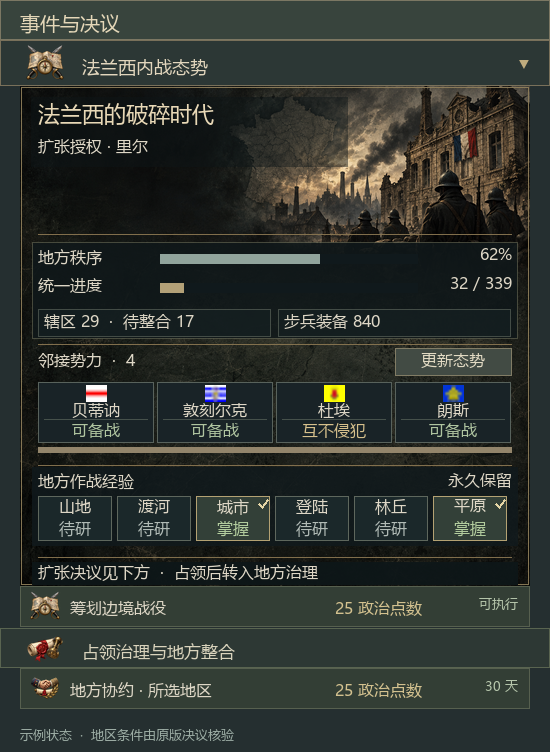

# 法兰西之影：统一战争

《钢铁雄心 IV》独立中文模组的协作源码。当前候选版本 **4.3.0**，适配游戏 **1.19.***。巴黎移植原版法国185项国策，科西嘉从原版意大利移植并删去无法迁移的分支后保留288项。4.3.0解除28对可以兼修的互斥，调整28个民族精神字段、科研与工业奖励，并为20个大区代表国家增加各有装备专长和代价的制造商。两棵树沿用原版坐标、前置与耗时，473幅独占插画继续使用4.2.0版本。40位历史内阁、12项实际领袖任命、其他国家153项通用国策、永久小幅地形经验及通用内战决议GUI继续保留。

[查看两国布局预览](docs/previews/4.3.0/INDEX.html) · [20家制造商与成长](docs/previews/4.3.0/MANUFACTURERS.html) · [平衡数值与迁移](docs/BALANCE-4.3-ZH.md) · [473项独占图标](docs/previews/4.3.0/ICONS.html) · [历史内阁画像与数值](docs/previews/4.1.0/HISTORICAL.html)



## 开始开发

需要Git与Python 3.12以上。检查与打包不需要游戏安装；实机验收需要本地HOI4。

```powershell
git clone https://github.com/worldhello-bj/shadows-of-france-unification.git
cd shadows-of-france-unification
python -m pip install -r requirements.txt
python tools/validate.py --output dist/validation.json
python tools/package.py
```

`dist/shadows-of-france-4.3.0.zip` 是独立候选安装包。解压后运行其中的 `install.ps1`；安装器会先备份原有独立版文件，再核验安装哈希，并保留已有创意工坊ID和封面。更新安装前应保存并关闭游戏。启用“法兰西之影：统一战争（独立中文版）”即可。

已有4.2.0并另外修改了人物或历史文件时，使用 `python tools/package_gameplay_patch.py` 生成的 `dist/shadows-of-france-gameplay-4.3.0.zip`。解压后运行 `install-gameplay.ps1`；补丁只覆盖本轮34个国策、精神、制造商及平衡载荷文件，并更新两个描述文件的版本号。安装前备份并核验哈希，保留其他本地修改；同名文件若有额外改动则停止安装。

图标来源为118幅本轮生成稿、47幅已有独立生成稿及308幅逐项筛选的原版插画，共473幅；两国之间没有共用插画。完整来源、提示词、内容哈希和原尺寸视觉复核记录在 `design/unique-focus-art*.json`。

## 编辑入口

| 路径 | 用途 |
|---|---|
| `mod/` | 游戏实际加载的完整源码与纹理，是协作修改的主入口 |
| `mod/common/national_focus/sofzh_paris.txt`、`sofzh_corsica.txt` | 两棵原版大国国策移植 |
| `mod/common/national_focus/SoF_generic.txt` | 其他国家使用的原有通用树，文件内容未修改 |
| `mod/common/national_focus/sof20_*.txt`、`*_legacy.txt` | 停用的历史树，仅保留脚本引用与旧档迁移兼容 |
| `mod/common/decisions/` | 内战、占领治理和各国地方协作决议 |
| `mod/interface/sof_civilwar.gui` | 通用内战面板的原生布局 |
| `mod/common/scripted_guis/sof_civilwar_gui.txt` | 数据绑定、动态旗帜列表及刷新操作 |
| `mod/gfx/interface/sof_civilwar/` | 背景、衬板、32像素决议图标及52×40分类徽章 |
| `art/civilwar/` | 12张美术原稿、PNG尺寸导出及完整生成提示词 |
| `art/focus/unique/` | 473项国策的独占原稿与96像素导出 |
| `art/focus/source/` | 历史48幅原稿；仍供民族精神与决议导出使用 |
| `design/focus-art-spec.json`、`focus-art-bindings.json` | 完整生成提示词、原稿哈希和逐项图标绑定 |
| `design/unique-focus-art.json`、`native-focus-art-selection.json` | 独占图标来源、生成提示词、原版取材及视觉筛选记录 |
| `design/vanilla-major-remake.json` | 两国原版节点对照、奖励适配、原文与来源哈希 |
| `design/balance-4.3.json` | 逐对互斥调整、精神与变量数值、科研门槛及4.2基线哈希 |
| `design/regional-manufacturers.json` | 20家企业的厂址、装备专长、四级成长、代价及原版图标来源 |
| `design/country-design.json` | 3.x历史设计数据；已不决定4.0的国策选择 |
| `references/vanilla/` | 本机1.19.3原版底稿，供对照与重建 |
| `tools/` | 可移植的检查、纹理导出与打包脚本 |
| `docs/` | GUI规范、协作约定、历史检查报告和预览 |

## 当前版本行为

- 六类地形经验为永久修正，同类只授予一次，统一后保留。数值见[GUI设计说明](docs/CIVILWAR-DESIGN-ZH.md)。
- 内战面板适用于法国首都、独立且未投降的国家；显示当前阶段、稳定度、完整控制的法国地区数、邻接势力及经验状态。
- 11种透明图标覆盖132条决议和21个分类。正文使用原版中文字体，内容区510×500像素。
- 边境战役仍需25政治点数、45天冷却及扩张授权。美术更新不改变现有决议费用、条件、奖励或AI。
- 新增第3、4、5个科研槽分别要求6、10、20家工厂，已有科研槽保留；科西嘉的九类国策专用累积变量设有上下限，旧档只调整一次奖励差额。
- 地区制造商在完成工业国策并完全控制本地厂址后解锁。启用AAT时使用军工组织及四级成长，缺少AAT时使用传统设计商的起始工艺。

## 协作与验证

从 `main` 建立功能分支，提交后开Pull Request。按[CONTRIBUTING.md](CONTRIBUTING.md)记录修改、检查结果与实机范围。GitHub Actions在推送和PR时执行源码／美术检查并打包候选产物；流程依据[GitHub官方Python工作流文档](https://docs.github.com/en/actions/tutorials/build-and-test-code/python)。

4.3.0检查继续核验473项图标的独占性，并逐项对照原版布局、前置与耗时。玩法变更按明确白名单检查，覆盖旧档差额迁移及重复运行、科研门槛、制造商DLC双路径和厂址丢失情景。原有54组迁移模拟、历史内阁与领袖生命周期检查继续执行；报告在 `docs/reports/4.3.0/`。**游戏内加载、GUI显示、真实旧档迁移及长期平衡仍待验证。** 预览来自实际源码，不是游戏截图。
